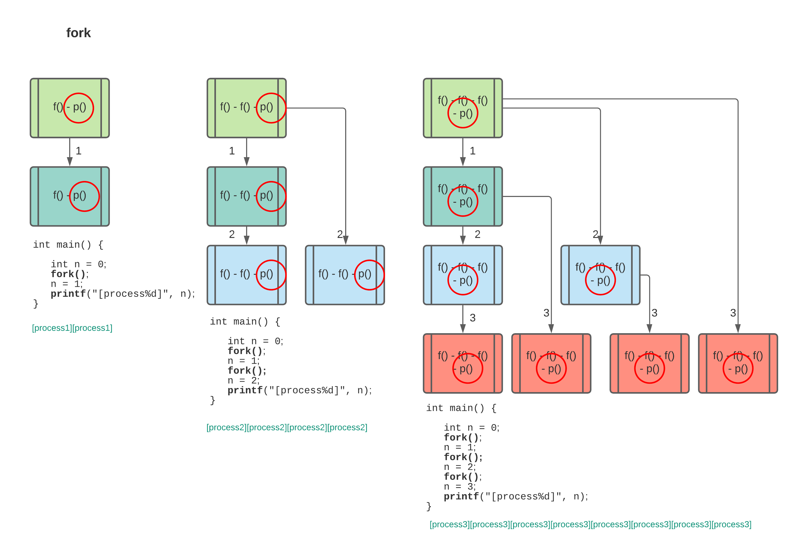
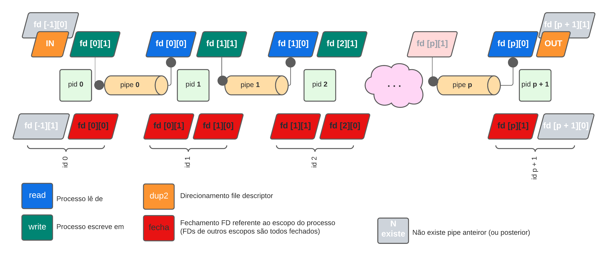

# minishell

The objective of this project is to create a simple shell. My own little bash or zsh.
I will learn a lot about processes and file descriptors.

## Scope of vars to pipes:
  

## File descriptors in multiple processes
  
